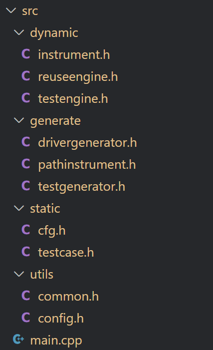
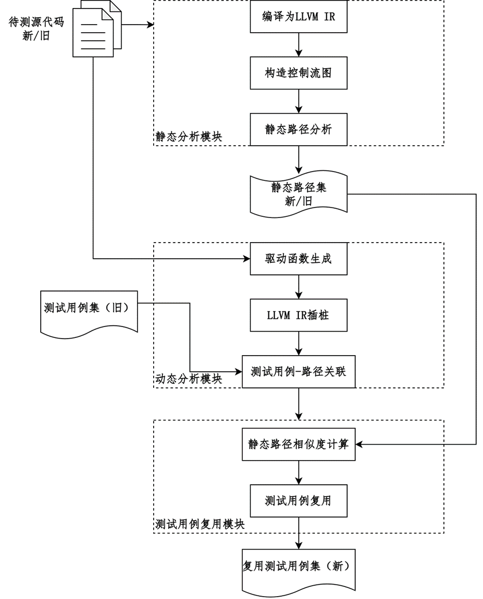
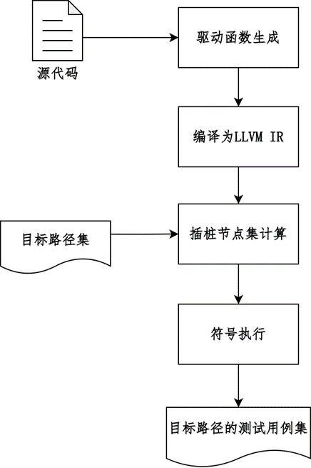

# 代码文档
## 代码结构
### 主要代码

- ``main.cpp``: main函数入口，里面有把工具分成测试用例复用和生成两部分。
- ``static``: 主要是对于程序的静态分析，包括CFG构造和路径分析，以及测试用例的设计等等。
- ``dymamic``: 主要是对于程序的动态分析，包括IR插桩记录用例运行路径，测试用例的测试执行以及复用。``reuseengine.h``中有路径相似度计算算法。
- ``generate``: 测试用例自动生成的部分和驱动函数自动生成的部分。
- ``utils``: ``commom.h``是项目用到的一些常用函数，``config.h``中是项目的一些配置，包括脚本位置，以及测试用例复用时的阈值（相似度超过阈值全部复用，没超过的话复用输入值忽略期望值）
### 其他文件
- scripts中有几个项目使用到的脚本，分别是代码运行后的清理脚本、把llvm ir控制流图转成png图片的脚本和使用klee批量符号执行.ll文件的脚本。
- patch是针对klee-3.1版本的补丁，用于特定路径的测试用例的自动生成。

## 测试用例复用
工作流程:

- 控制流图构造和路径分析部分在``static/cfg.h``中，路径分析对于循环只做展开一次处理。
- 驱动函数生成的部分在``generate/drivergenerator.h``中，目前还只对简单数据类型做了适配(int、uint、char、char*、int*)。
- 相似度计算和复用的主要代码在``dynamic/reuseengine.h``中，相似度计算公式在类``SimilarityStrategy``中，使用了编辑距离公式计算路径与路径之间的相似度和节点与节点之间的相似度。

## 未覆盖路径的测试用例生成
工作流程：

- 待测函数的klee驱动函数生成部分也在``generate/drivergenerator.h``中，目前也只对简单数据类型做了适配。
- 路径插桩部分在``generate/pathinstrument.h``中，在目标路径中的关键节点添加``klee_path_trigger``函数的调用，在其他不相关路径的节点中添加``klee_path_conditional_exit``函数的调用来让klee退出这条路径的搜索。
- 使用的klee符号执行工具需要先打补丁才能识别``klee_path_trigger``和``klee_path_conditional_exit``这两个函数。
